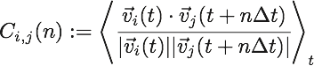

# DCBR v2
タンパク質の残基間の速度相関関数を解析するためのプログラムである。

## 速度相関関数の定義

- 
- 
-  :  番目の残基のうちを除いた全ての原子の位置の平均
-  : サンプリング対象の時刻
-  : 入力ファイル内の最小の時間間隔
-  :  で平均
-  :  のノルム(L2)

## 使用
dcbr

in=入力.pdb

out=出力ファイル名

step=サンプリング開始時刻-終了時刻

target=対象残基は何番めの残基か？(i)

delta=n_max (n=[0:n_max]で解析する)

オプション --silence

を１行で実行すること。

## ビルド
例: clang++-5.0 -std=c++1z -stdlib=libc++ main.cpp -O2 -o dcbr

また、コードは boost を利用しているため、設定していないのなら、それについてパスを通す必要がある。

boost を macports でインストールしているのなら、-I/opt/local/include/ を上記のものに追加する。
